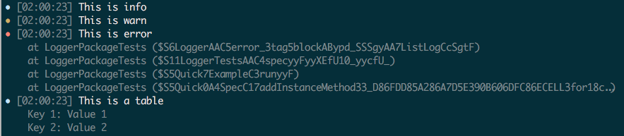

# Logger



Swift log library

## Example

``` swift
import Logger

// Optional, default level: .info
let log = Logger(.info, time: false)

log.info("This is info")
log.warn("This is warn")
log.error("This is error")
log.debug("This is debug")

log.info("This is a table") { table in
  table.kv("Key 1", "Value 1")
  table.kv("Key 2", "Value 2")
}
```

## Install

``` swift
// swift-tools-version:4.0
import PackageDescription

let package = Package(
  name: "YOUR_PROJECT_NAME",
  dependencies: [
    .package(url: "https://github.com/oleander/swift-logger.git", .branch("master")),
  ]
)
```
